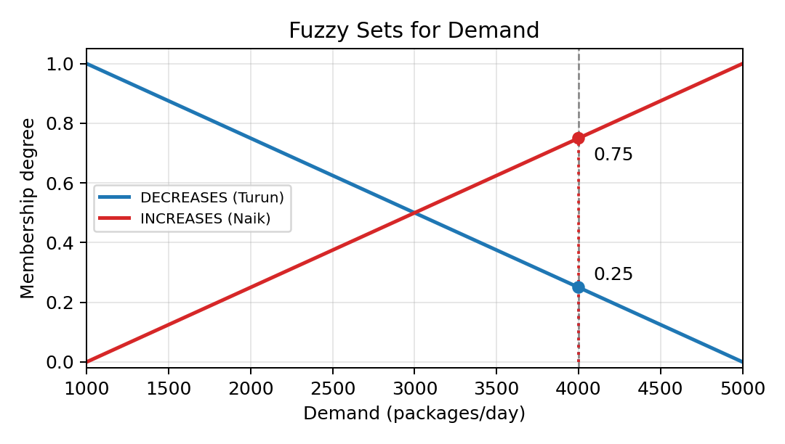
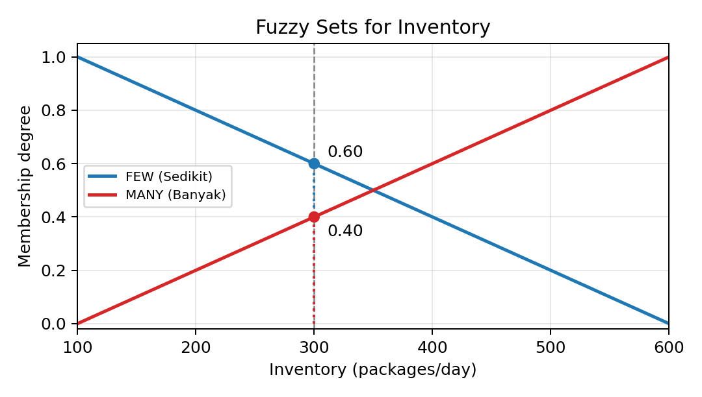
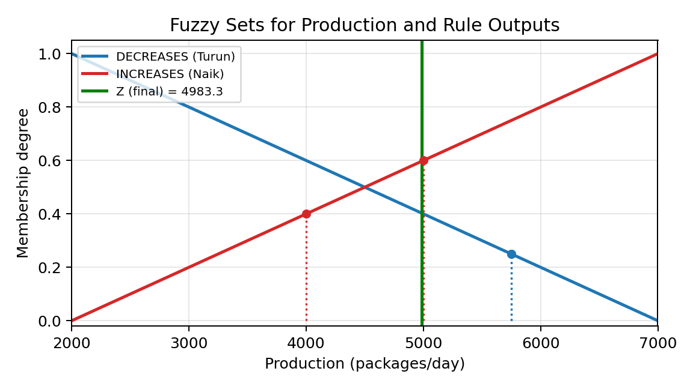

# Task 2 - Fuzzy Inference System

**Kecerdasan Komputasional dan Pembelajaran Mesin**
Magister Ilmu Komputer, DIKE, FMIPA, Universitas Gadjah Mada — 2026

Anugrah Putra Al Fatih — 26/590120/PPA/07385

## Problem

A canned food company produces type ABC food. Based on last month's data:

| Variable | Min | Max |
|---|---|---|
| Demand | 1,000 | 5,000 packages/day |
| Warehouse inventory | 100 | 600 packages/day |
| Production | 2,000 | 7,000 packages/day |

Production is governed by four fuzzy rules:

- **R1**: IF Demand DECREASES AND Inventory MANY THEN Production DECREASES
- **R2**: IF Demand DECREASES AND Inventory FEW THEN Production DECREASES
- **R3**: IF Demand INCREASES AND Inventory MANY THEN Production INCREASES
- **R4**: IF Demand INCREASES AND Inventory FEW THEN Production INCREASES

**Question:** how many packages must be produced if demand = 4,000 and inventory = 300?

## Method

Since both consequent sets (Production DECREASES / INCREASES) are monotonic, the
**Tsukamoto fuzzy inference method** is used:

1. Fuzzify the crisp inputs with linear membership functions.
2. Evaluate each rule's firing strength with the fuzzy AND operator (`min`).
3. Invert each rule's monotonic consequent function to get its own crisp output `z_i`.
4. Defuzzify with the firing-strength-weighted average of all `z_i`.

## Result

```
Demand = 4000  -> mu_DECREASES = 0.25, mu_INCREASES = 0.75
Inventory = 300 -> mu_FEW = 0.60, mu_MANY = 0.40

alpha1 = 0.25   z1 = 5750.00
alpha2 = 0.25   z2 = 5750.00
alpha3 = 0.40   z3 = 4000.00
alpha4 = 0.60   z4 = 5000.00

Z = (0.25*5750 + 0.25*5750 + 0.40*4000 + 0.60*5000) / (0.25+0.25+0.40+0.60)
Z = 4983.33
```

**Recommended production ≈ 4,983 packages/day**, which lies comfortably within the
feasible range of [2,000, 7,000] packages/day.

| Demand | Inventory | Production |
|---|---|---|
|  |  |  |

## Files

| File | Description |
|---|---|
| `FIS_Report_Canned_Food_Production.pdf` | Full report: problem statement, membership functions, step-by-step Tsukamoto calculation, and interpretation |
| `fis_canned_food.py` | Standalone Python script that reproduces the calculation and regenerates the plots below |
| `mf_demand.png`, `mf_inventory.png`, `mf_production.png` | Membership function plots generated by the script |

## Running the code

```bash
pip install numpy matplotlib
python fis_canned_food.py
```

This prints every intermediate value (fuzzification, rule firing strengths, per-rule
crisp outputs, final defuzzified production) and regenerates the three `.png` plots.
